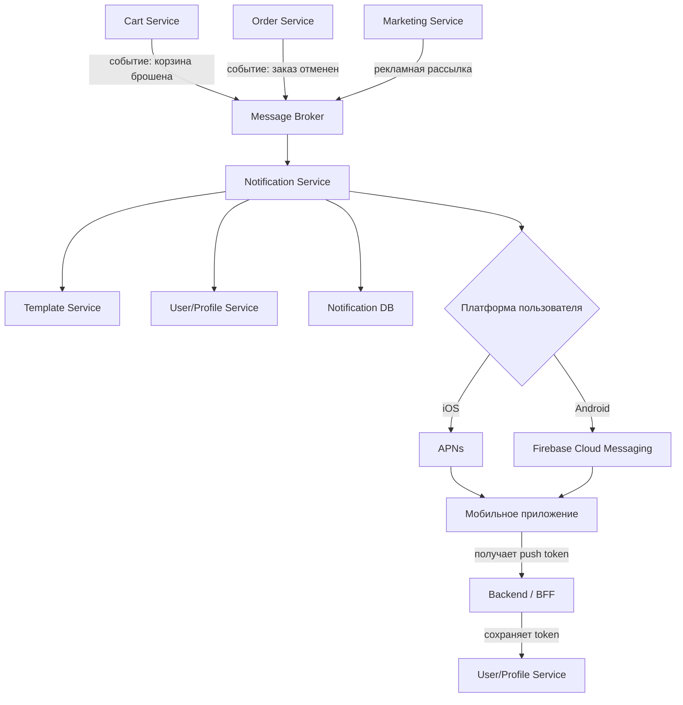

```mermaid
flowchart TD
    A[Мобильное приложение] -->|получает push token| B[Backend / BFF]
    B -->|сохраняет token| C[User/Profile Service]

    D[Cart Service] -->|событие: корзина брошена| E[Message Broker]
    F[Order Service] -->|событие: заказ отменен| E
    G[Marketing Service] -->|рекламная рассылка| E

    E --> H[Notification Service]

    H --> I[Template Service]
    H --> J[User/Profile Service]
    H --> K[Notification DB]

    H --> L{Платформа пользователя}
    L -->|iOS| M[APNs]
    L -->|Android| N[Firebase Cloud Messaging]

    M --> A
    N --> A
```
